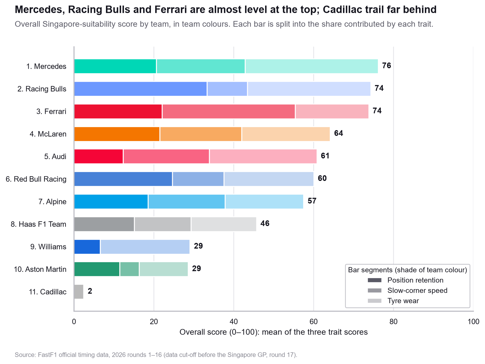
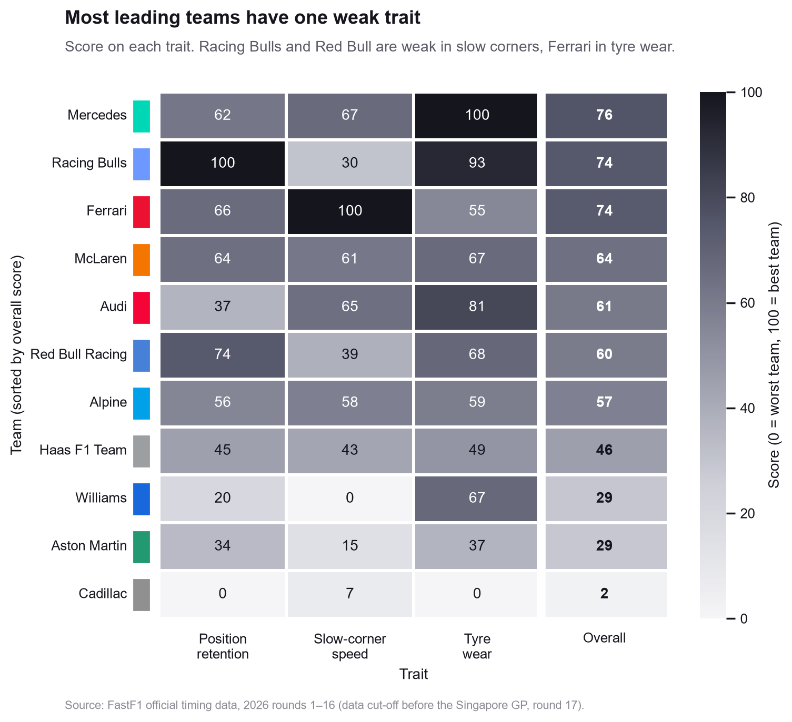
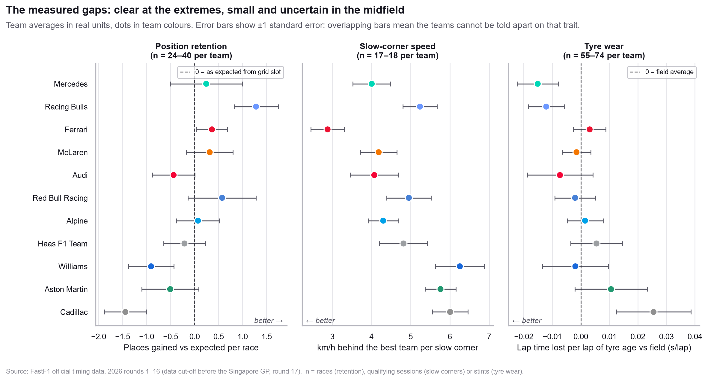
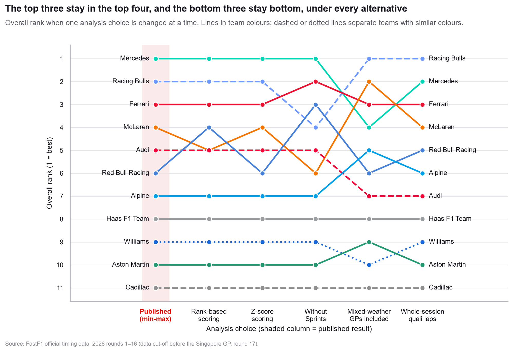

# Singapore GP 2026: Which Teams Suit Marina Bay?

A pre-race analysis of the 2026 Formula 1 Singapore Grand Prix. All 11 teams are scored on the three traits the circuit rewards, using official timing and telemetry from the 2026 season. The scores are frozen publicly before the race and then tested against the actual result.

> **Research question:** based on their 2026 season so far, which teams have the strongest profile for the Singapore Grand Prix?

This is a descriptive analysis, not a race-winner prediction. Information cutoff: rounds 1–16, all completed before Singapore (round 17, Oct 9–11).

| At a glance | |
|---|---|
| Season scope | 2026 rounds 1–16: 16 Grands Prix, 5 Sprints, with their qualifying sessions |
| Teams | 11 |
| Data analysed | 20,527 race laps · 718 tyre stints · 386 driver-races · 3,333 telemetry corner readings |
| Data source | [FastF1](https://docs.fastf1.dev) (official F1 timing data) |
| Scores frozen | Oct 8, 2026: GitHub Release `pre-race-snapshot` |

---

## Key findings

1. **Mercedes (76), Racing Bulls (74) and Ferrari (74) have the strongest Singapore profiles and are almost level.** They finish in the top 4 under every alternative analysis choice tested.
2. **Most leading teams have one weak trait.**
   - Racing Bulls and Red Bull are weak in slow corners.
   - Ferrari is weak on tyre wear.
   - Mercedes and McLaren are the only teams scoring above 60 on all three traits.
3. **Cadillac (2), Aston Martin (29) and Williams (29) have the weakest profiles.** They finish bottom 3 under every alternative.
4. **The midfield is not clearly separated.** McLaren, Audi, Red Bull, Alpine and Haas sit within measurement uncertainty of each other, so their exact order should not be over-read.

<p align="center"></p>
<p align="center"></p>

---

## The three traits

| Trait | Why it matters at Singapore | Measured as | Better |
|---|---|---|---|
| **Position retention** | Narrow, walled street circuit where overtaking is very hard | Places gained in each Grand Prix and Sprint, compared with the average car starting from the same grid slots | Higher |
| **Slow-corner speed** | 19 mostly slow corners, short straights | Minimum telemetry speed at every corner under 120 km/h on each team's fastest Q1 / SQ1 lap, as km/h behind the best team | Lower |
| **Tyre wear** | Hot, humid, ~62-lap race | Lap time lost per lap of tyre age in each stint, compared with the field on the same tyre in the same session | Lower |

**Scoring:** on each trait the best team scores 100, the worst 0, and the rest in proportion to their measured value. The overall score is the equal-weight average.

Full definitions, formulas, sign conventions and every data decision are in [docs/methodology.md](docs/methodology.md).

---

## How certain are these results?

**Figure 3** shows the measurements behind the scores in real units, with ±1 standard-error bars. The extremes are clear; most midfield gaps overlap. Slow-corner speed is the most precise trait, and tyre wear the noisiest.

<p align="center"></p>

**Figure 4** changes one analysis choice at a time: the scoring method, including Sprints or not, including mixed-weather races, and which qualifying laps are used. The top three and bottom three hold under every alternative.

<p align="center"></p>

**Figure 5** is a worked example of the tyre-wear measurement: a typical Mercedes stint against a typical Cadillac stint. [View figure](reports/figures/fig5_tyre_wear_example.png).

---

## Testing the scores against the race

The comparison method was written down before the race ([methodology §6](docs/methodology.md#6-pre-registered-post-race-test)):
- **Test A:** Spearman rank correlation between the pre-race overall score and each team's mean finishing position, separately for the Singapore Sprint (Oct 10) and Grand Prix (Oct 11).
- **Test B:** each trait recomputed on Singapore alone, correlated with its pre-race score.

*Results will be added after Oct 11.*

---

## Limitations

- **Small sample.** Only 16 rounds under brand-new 2026 rules, with early-season races weighted the same as recent ones.
- **Noise.** Tyre wear is noisy: a driver saving tyres can make a slow car look gentle on them.
- **What position retention captures.** It partly reflects overall race pace, and it ignores reliability because retirements are excluded.
- **Not scored:** safety cars, night and heat effects, and Singapore's first Sprint weekend.
- **Team-level only.** Scores hide driver differences; Gasly/Colapinto and Verstappen/Hadjar are the most lopsided pairings.
- **2026 telemetry quirks.** About 8% of corner speed readings were stalled and dropped, and corners are located by track position because distance along the lap drifts. Details are in [methodology §3.2](docs/methodology.md#32-slow-corner-speed-how-fast-is-the-car-through-slow-corners).

---

## Repository structure

```text
f1-singapore-2026/
├── README.md
├── config.py                  every setting: rounds, thresholds, exclusions
├── run_pipeline.py            runs steps 1–5 in order
├── requirements.txt
├── scripts/
│   ├── 01_pull_sessions.py        download laps and results (FastF1)
│   ├── 02_pull_corner_speeds.py   corner speeds from qualifying telemetry
│   ├── 03_check_data.py           per-round coverage check
│   ├── 04_compute_scores.py       metrics → team scores, robustness table
│   └── 05_make_figures.py         the five figures
├── src/
│   ├── metrics.py             the three trait definitions
│   ├── scoring.py             min-max scoring and robustness scenarios
│   ├── palette.py             one colour palette: official team colours + neutral greys
│   └── plotting.py            figures (matplotlib + seaborn)
├── tests/test_metrics.py      hand checks against known 2026 results
├── notebooks/sanity_checks.ipynb  the checks behind each analysis decision
├── docs/
│   ├── methodology.md         definitions, decisions, limitations
│   └── data_dictionary.md     every table and column
└── reports/
    ├── figures/               fig1–fig5 (PNG)
    └── tables/                team_scores.csv · robustness.csv · data_coverage.csv
```

Downloaded data (`data/`) and the FastF1 cache (`cache/`) are not in git; step 1 rebuilds them.

---

## Reproduce

Requires Python 3.13.

```bash
python -m venv .venv
.venv\Scripts\python.exe -m pip install -r requirements.txt
.venv\Scripts\python.exe run_pipeline.py          # first run downloads ~1.2 GB of FastF1 data
.venv\Scripts\python.exe -m pytest                # 8 hand checks
```

`python run_pipeline.py --skip-pull` rebuilds every table and figure from already-downloaded data. Changing a value in `config.py` and re-running reproduces the analysis under that setting.

---

## Data and trademark notice

Timing and telemetry data come from the public F1 live-timing feed via [FastF1](https://github.com/theOehrly/Fast-F1). This is an independent portfolio project, not affiliated with or endorsed by Formula 1, the FIA, or any team. Formula 1, F1, team names and related marks belong to their respective owners.
